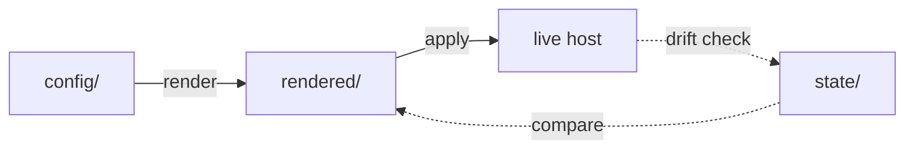
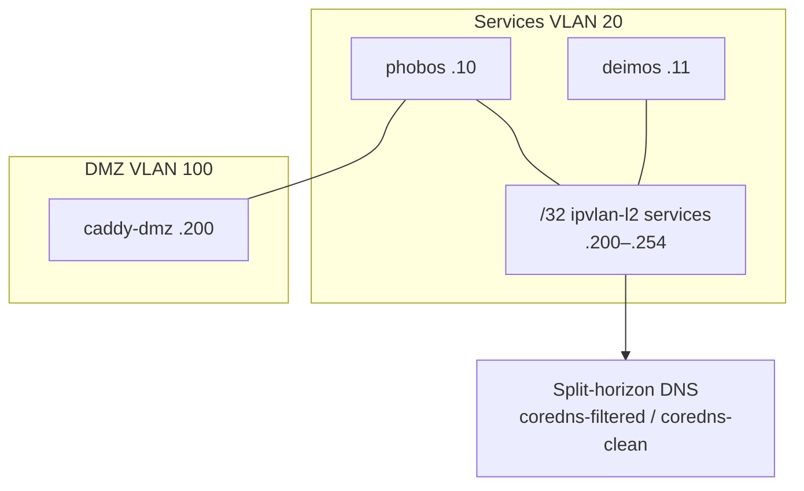
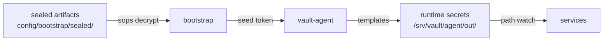

# Architecture

Abhaile is a GitOps-managed homelab running on two Debian 13 hosts (phobos, deimos). Desired state lives in `config/`, is rendered into host-specific artifacts, and applied with hash-based drift detection. The system converges hosts toward declared intent without manual changes.

## Pipeline

Render is unprivileged and deterministic. Apply is privileged, atomic, and defaults to dry-run. See [README](../README.md) for design principles.

## Network Topology

Each containerized service gets a deterministic /32 address on ipvlan-l2. See [INVENTORY.md](INVENTORY.md) for the full address table.

## Secrets Flow

No secrets in git or rendered output. Vault Agent renders credentials at runtime to host-only paths.

## Key Components

| Layer | Role | Key paths |
|-------|------|-----------|
| Config | Source of truth | `config/mapping.yaml`, `config/network.yaml`, `config/services/*/service.yaml` |
| Render | Deterministic artifact generation | `src/abhaile/renderers/`, `src/abhaile/cli/render.py` |
| Apply | Host reconciliation with drift detection | `src/abhaile/apply/`, `src/abhaile/cli/apply.py` |
| Plan | Manifest comparison and owner ordering | `src/abhaile/plan/diff.py` |
| Runner | GitOps scheduling, fetch, rollback | `scripts/abhaile-runner` |
| Bootstrap | Fresh host enrollment | `scripts/bootstrap.sh` |

## Where to Look

| I want to... | Go to |
|---|---|
| Understand the reconciliation model | [README.md](../README.md) |
| See which services run where | [config/mapping.yaml](../config/mapping.yaml) |
| See IP/VLAN assignments | [config/network.yaml](../config/network.yaml) |
| Add or modify a service | `config/services/<name>/service.yaml`, [ADR 0005](adr/0005-service-authoring-model.md) |
| Understand apply phases | [Spec 0009](specs/accepted/0009-apply-pipeline.md) |
| Understand secrets boundary | [ADR 0006](adr/0006-secrets-model-and-bootstrap-artifacts.md) |
| Run render/apply locally | `make render`, `make apply HOST=<host>` |
| Check spec status | [docs/specs/README.md](specs/README.md) |
