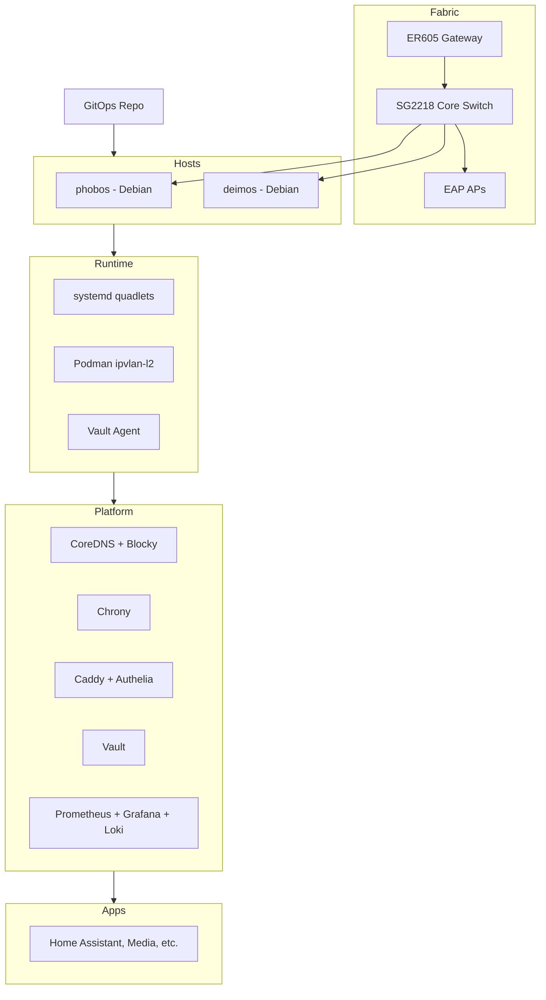
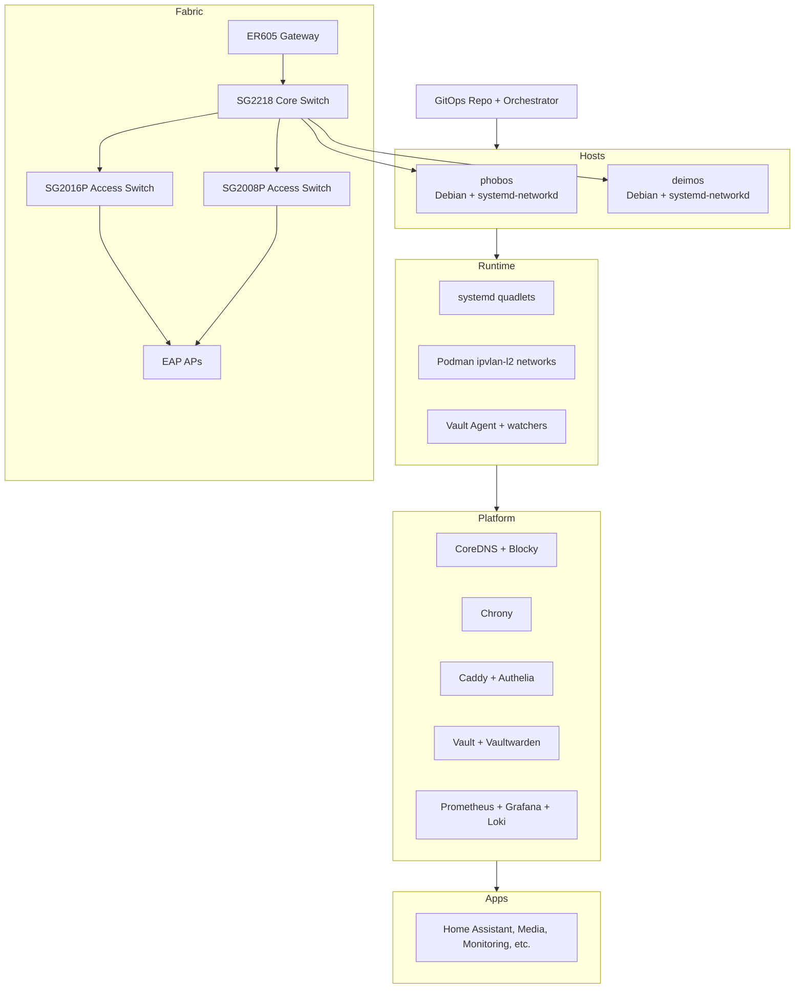
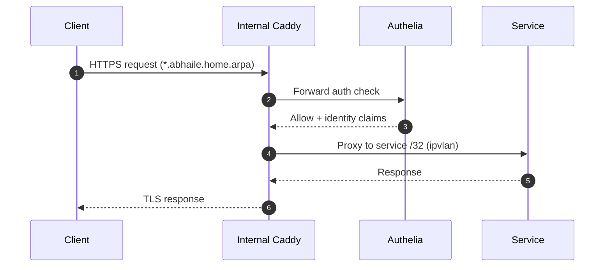

# Architecture

Abhaile's GitOps architecture for two Debian hosts (`phobos`, `deimos`): network intent, host configuration, service deployment. This document provides the structural view and ADR index.

See also: [OPERATIONS.md](OPERATIONS.md) for deployment workflows, [NETWORK.md](NETWORK.md) for topology.

## System Design

### Core Components

**Hosts:** `phobos` and `deimos` (Debian, systemd, Podman)

**Network model:**

- Host services: `service-32` with systemd-networkd drop-ins
- Container services: `ipvlan-l2` networks for per-service `/32` addresses

**GitOps pipeline:**

- Source: `config/mapping.yaml`, `config/network.yaml`, `config/services/<svc>/service.yaml`
- Render: `tools/render/cli.py` generates host configs, quadlets, DNS, Vault templates
- Apply: `tools/apply/apply.sh` validates, stages, drift-checks, applies atomically
- State: `out/state/*` (dev) or `/var/lib/abhaile/state` (production)

**Network fabric:** TP-Link Omada (ER605 gateway, SG switches, EAP APs) with VLAN segmentation and default-deny ACLs.

Design anchors: [ADR 0002](ADR/0002-service-addressing-ipvlan.md), [ADR 0003](ADR/0003-dns-split-horizon.md), [ADR 0006](ADR/0006-networkd-service-dropins.md)

### Service Placement Strategy

Services are distributed across two Debian hosts based on resource needs, network exposure, and hardware capabilities:

- **phobos**: Core infrastructure (DNS, Vault, Caddy), ingress, security services

  - Hosts critical platform services with high availability
  - Manages internal and DMZ network ingress
  - Connected via trunk interface (VLAN 20 native, VLAN 100 tagged)

- **deimos**: Media, downloads, and storage-heavy workloads

  - Isolated from core services to avoid resource contention
  - Dedicated to high-bandwidth operations (transcoding, sync, backups)
  - Connected via access interface (VLAN 20 only)

**Placement considerations:** GPU/TPU access, per-VLAN exposure, service dependencies, persistent storage location. Placement may shift in future as service demands change.

## System Layers

## System Topology (Detailed)

## HTTP Request Flow with SSO

## TLS and Ingress

- **Internal:** `abhaile.home.arpa` with Caddy `tls internal`
- **External:** `abhaile.dedyn.io` via DNS-01 (deSEC)
- **DMZ:** Caddy on VLAN 100; hairpin NAT on ER605
- **Trust:** Internal CA distribution

## ADR Index

**Foundational Architecture Decisions:**

- [0001](ADR/0001-host-level-gitops.md): Host-Level GitOps as the Source of Truth
- [0002](ADR/0002-service-addressing-ipvlan.md): `/32` Service Addressing via ipvlan-l2 Networks
- [0003](ADR/0003-dns-split-horizon.md): Split-Horizon DNS with Dual CoreDNS
- [0004](ADR/0004-secrets-sops-vault.md): Secrets via SOPS for Bootstrap, Vault for Runtime
- [0005](ADR/0005-podman-quadlets.md): Podman Quadlets for Deterministic Container Networking
- [0006](ADR/0006-networkd-service-dropins.md): systemd-networkd Drop-Ins for Service `/32`s
- [0007](ADR/0007-atomic-host-apply.md): Atomic Deployments via `apply.sh`
- [0008](ADR/0008-dual-caddy-authelia-ingress.md): Dual Caddy + Authelia Ingress (Internal & DMZ)

**Security Architecture:**

- [0009](ADR/0009-secrets-decryption-boundary.md): Secrets Decryption Boundary
- [0010](ADR/0010-gitops-privilege-boundary.md): GitOps Privilege Boundary

**Note:** Operational policies (backup, monitoring, naming conventions, etc.) have been consolidated into main documentation. See [OPERATIONS.md](OPERATIONS.md), [NETWORK.md](NETWORK.md), and [DEVELOPMENT.md](DEVELOPMENT.md) for implementation details.

## Design Decisions Summary

| Problem | Decision | Trade-offs | ADR |
| --- | --- | --- | --- |
| Deterministic addressing | Per-service `/32` with ipvlan-l2 | Additional ARP entries | [0002](ADR/0002-service-addressing-ipvlan.md) |
| Split-horizon DNS | Dual CoreDNS (filtered/clean) | Duplicate monitoring | [0003](ADR/0003-dns-split-horizon.md) |
| Secret handling | SOPS for bootstrap, Vault for runtime | Vault bootstrap dependency | [0004](ADR/0004-secrets-sops-vault.md) |
| Prevent config drift | Render + atomic apply with state tracking | More tooling complexity | [0007](ADR/0007-atomic-host-apply.md) |
| Enforce SSO/HTTPS | Dual Caddy + Authelia | Extra hop latency | [0008](ADR/0008-dual-caddy-authelia-ingress.md) |

## See Also

- [QUICKSTART.md](QUICKSTART.md) – Get started quickly
- [OPERATIONS.md](OPERATIONS.md) – Deployment workflows
- [NETWORK.md](NETWORK.md) – Network topology and ACLs
