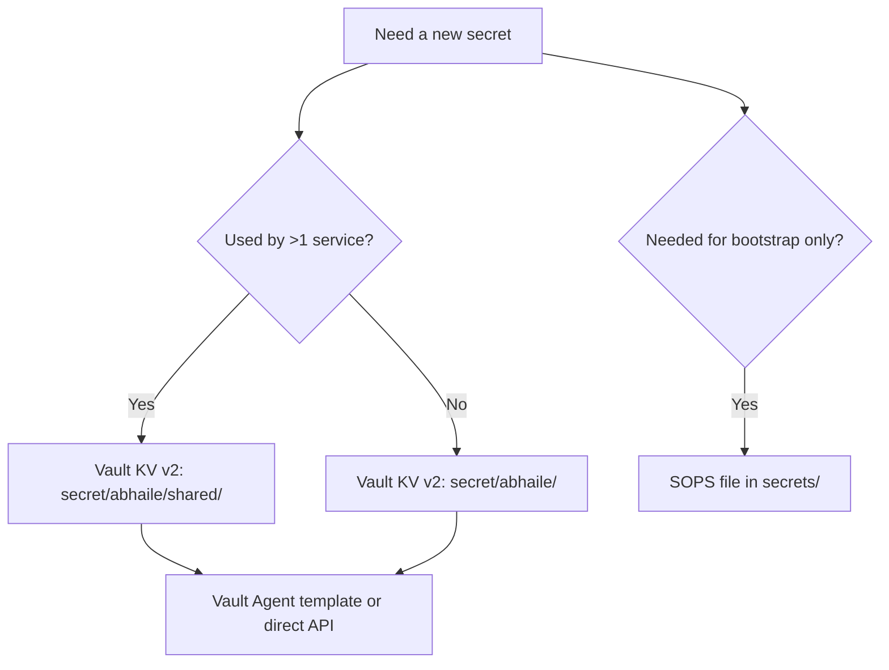

# Credentials & Secrets

Secrets management: SOPS for bootstrap, Vault for runtime, rotation workflows. See [ADR 0009](ADR/0009-secrets-decryption-boundary.md) for the decryption boundary.

## Guiding Principles



Notes:

- SOPS files live under `secrets/` and are encrypted with Age recipients per host group.
- Vault paths mirror service slugs: `secret/abhaile/<svc>/...`.
- Shared material (SMTP relay creds, ACME tokens) live under `secret/abhaile/shared/`.

## Secret Catalog

| Category | Examples | Storage | Access Path | Rotation Target |
| --- | --- | --- | --- | --- |
| **Bootstrap Artifacts** | Vault unseal keys, git deploy key, Omada adoption creds | SOPS in Git | `secrets/*.sops.yaml` | Rotate on compromise or hardware change |
| **Platform Tokens** | deSEC DNS token, SMTP relay creds, CrowdSec bouncer key | Vault shared path | `secret/abhaile/shared/<token>` | Quarterly |
| **Service Auth Secrets** | Authelia JWT secrets, NetBox admin, Grafana admin | Vault per-service | `secret/abhaile/<svc>/...` | Semi-annual or on change |
| **Infrastructure Keys** | SSH host keys, WireGuard keys, internal CA | Host files (backed up) | `/etc/ssh`, `/var/lib/wireguard`, `/var/lib/caddy/pki` | Per vendor guidance |

## Encrypted Files (SOPS) – Bootstrap Phase

The following SOPS files must be created before GitOps can deploy:

| File | Purpose | Decrypted Destination | Used By |
| --- | --- | --- | --- |
| `secrets/gitops-phobos.sops.env` | Git repo URL, branch, work dir | `/etc/abhaile/gitops/.env` | `gitops_runner.sh` (timer) |
| `secrets/gitops-deimos.sops.env` | Git repo URL, branch, work dir | `/etc/abhaile/gitops/.env` | `gitops_runner.sh` (timer) |
| `secrets/vault-agent-approle-phobos.sops.env` | Vault AppRole credentials for phobos | `/etc/abhaile/vault-agent-approle/phobos.env` | `vault_token_refresh.sh` (timer) |
| `secrets/vault-agent-approle-deimos.sops.env` | Vault AppRole credentials for deimos | `/etc/abhaile/vault-agent-approle/deimos.env` | `vault_token_refresh.sh` (timer) |
| `secrets/caddy-dmz-desec.sops.yaml` | deSEC API token for DNS-01 ACME | `/etc/abhaile/caddy-dmz-desec/caddy-dmz-desec.env` | `gitops_runner.sh` (on pull) |
| `secrets/vault-unseal.sops.yaml` | Vault unseal keys (existing) | `/tmp/vault-unseal-keys` | `vault_unseal.sh` (oneshot) |

### Creating SOPS Files

1. Copy the corresponding `.sops.env.example` file to the target name (without `.example`)

1. Edit the plaintext file with actual values:

   ```bash
   cp secrets/gitops-phobos.sops.env.example /tmp/gitops-phobos.env
   # Edit /tmp/gitops-phobos.env with real REPO_URL, GIT_SSH_KEY path, etc.
   ```

1. Encrypt with SOPS:

   ```bash
   sops -e /tmp/gitops-phobos.env > secrets/gitops-phobos.sops.env
   ```

1. Verify decryption works:

   ```bash
   sops -d secrets/gitops-phobos.sops.env | head
   ```

1. Commit the encrypted file to Git; delete the plaintext temp file.

See [secrets/README.md](../secrets/README.md) for Age key setup.

## Rotation Workflows

### SOPS-Backed Material

1. Edit using `sops secrets/<file>.sops.env` (for env secrets) or `sops secrets/<file>.sops.yaml` (for YAML secrets).
1. Update offline copies where required (unseal shards).
1. Merge to `main`, allow the GitOps runner to pull, and validate bootstrap services.

### Vault-Backed Material

1. `vault kv put secret/abhaile/<svc>/key=<value>` (or shared path).
1. Restart `vault-agent@<svc>.service` or allow watchers to reload.
1. Verify service health before revoking old credentials upstream.
1. Record rotation in ops log.

## Access Control & Auditing

- Vault policies in `policies/*.hcl` limit read scopes.
- Vault audit logs ship to Loki for tamper-evident storage.
- Age private keys live at `/home/abhaile/.config/sops/age/keys.txt` (mode 0600), owned by `abhaile:abhaile` user.
- See [ADR 0010](ADR/0010-gitops-privilege-boundary.md) for privilege boundary details.

## Incident Response

- **SOPS key leak**: rotate Age keypair, re-encrypt SOPS files, redeploy GitOps runner creds.
- **Vault token abuse**: revoke token, inspect audit logs, rotate impacted secrets.
- **Service credential leak**: update Vault, trigger redeploys, adjust ACLs/firewall rules.

## SOPS Age Key Setup

### Generate Age Key

Run on trusted admin machine (not target hosts):

```bash
age-keygen -o age-keys.txt
# Record the public recipient (age1...) for .sops.yaml
```

Store private key securely offline.

### Install on Host

```bash
# Create directory
sudo mkdir -p /home/abhaile/.config/sops/age
sudo chmod 700 /home/abhaile/.config/sops/age

# Copy private key
sudo install -m 600 age-keys.txt /home/abhaile/.config/sops/age/keys.txt
sudo chown abhaile:abhaile /home/abhaile/.config/sops/age/keys.txt

# Verify
sudo -u abhaile sops -d secrets/vault-unseal.sops.yaml > /dev/null
```

### Rotate Age Key

1. Generate new Age key (save public recipient)

1. Update `.sops.yaml` in repo with new recipient

1. Re-encrypt all SOPS files:

   ```bash
   for f in secrets/*.sops.{yaml,env}; do
     sops updatekeys "$f"
   done
   ```

1. Deploy new Age key to hosts

1. Destroy old Age private key

See [ADR 0009](ADR/0009-secrets-decryption-boundary.md) for decryption boundary policy.

## See Also

- [QUICKSTART.md](QUICKSTART.md) – Bootstrap workflow
- [OPERATIONS.md](OPERATIONS.md) – Security operations and rotation schedule
- [tools/vault/README.md](../tools/vault/README.md) – Vault automation scripts
