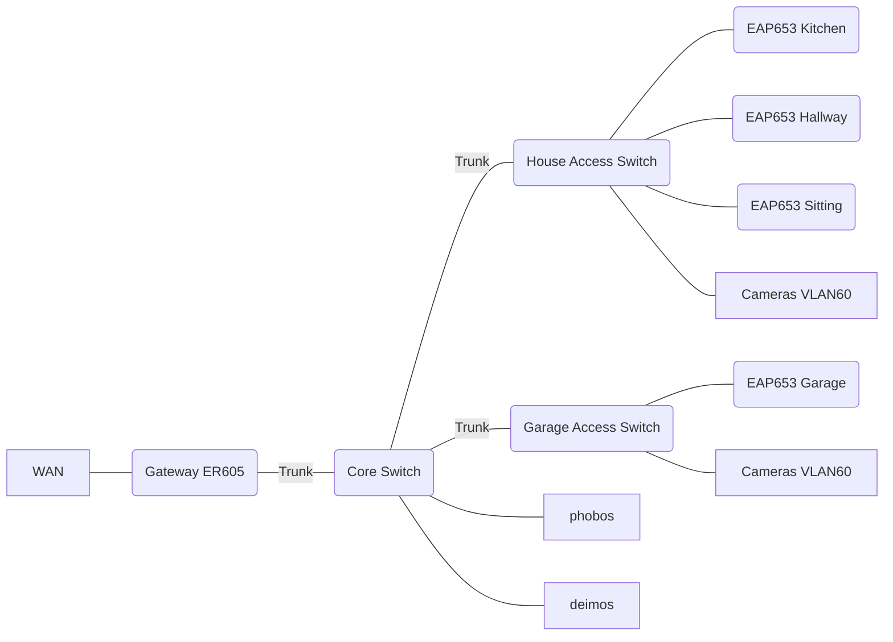

# Network Design

Complete network reference: physical topology, VLANs, ACLs, DNS, VPN, validation. Aligns with [ADR 0002](ADR/0002-service-addressing-ipvlan.md) and [ADR 0006](ADR/0006-networkd-service-dropins.md).

## At a glance

- VLAN scheme: 172.20.20.0/24 services VLAN; 172.20.100.0/24 DMZ VLAN
- Host links: phobos trunk (native 20, tagged 100); deimos access VLAN 20
- `/32` services via ipvlan-l2 drop-ins; ordering by last octet
- DNS: split-horizon CoreDNS (filtered 172.20.20.235, clean 172.20.20.236)
- DHCP options: DNS 235/236 (IoT override 236 only); NTP 237/238
- ACL stance: default deny; explicit allows in matrix (services→IoT/cameras, mgmt→all)

## 1. Physical Topology



- `phobos` connects via trunk profile (native VLAN 20, tagged 100) to SG2218 port 1.
- `deimos` uses access VLAN 20 on SG2218 port 2 (no DMZ).
- APs are Omada-managed trunks with SSIDs mapped to VLANs.

### Switch & Gateway Port Profiles

| Device / Port | Connection | Profile / Notes |
| --------------------- | ---------------------------- | ------------------------------------------------------ |
| **ER605** port 1 | WAN uplink | ISP connection |
| ER605 port 2 | SG2218 port 16 | Trunk, native VLAN 99 |
| ER605 port 5 | Break-glass | Untagged VLAN 1 for emergency adoption |
| **SG2218** port 1 | phobos | `TRUNK-Phobos` (native 20, tagged 100) + storm control |
| SG2218 port 2 | deimos | `ACCESS-Services` (VLAN 20) |
| SG2218 ports 3-12 | Wired endpoints | `ACCESS-General` (VLAN 30) |
| SG2218 port 13 | SG2016P port 16 | `TRUNK-AccessSwitch` uplink |
| SG2218 port 15 | SG2008P port 8 | `TRUNK-AccessSwitch` uplink |
| SG2218 port 16 | ER605 port 2 | `TRUNK-Core` uplink |
| **SG2016P** ports 1-3 | Kitchen/Hallway/Sitting APs | `AP-Uplink` trunks with PoE |
| SG2016P ports 4-7 | Cameras | `ACCESS-Cameras` (VLAN 60, isolation) |
| SG2016P port 8 | Zigbee coordinator (SLZB-06) | `ACCESS-IoT` (VLAN 50, PoE) |
| SG2016P ports 11-14 | Wired endpoints | `ACCESS-General` (VLAN 30) |
| SG2016P port 16 | SG2218 port 13 | Trunk uplink |
| **SG2008P** port 1 | Garage AP | `AP-Uplink` trunk |
| SG2008P ports 2-4 | Cameras | `ACCESS-Cameras` |
| SG2008P port 8 | SG2218 port 15 | Trunk uplink |

## 2. VLAN Definitions & Addressing

Convention: `172.20.<VLAN>.0/24` except VLAN 1 adoption (`192.168.0.0/24`). Gateway resides at `.1`. Hosts/services consume `.10–.29`; DHCP dynamic pool lives `.100–.199`. `/32` service allocations live in the ipvlan-l2 range (see `config/network.yaml`).

| VLAN | Name | Purpose | Subnet | DHCP | Notes |
| ---- | -------- | -------------------------------- | --------------- | ---- | ------------------------------------------- |
| 1 | Adoption | Emergency adoption / break-glass | 192.168.0.0/24 | ON | Only via ER605 port 5 |
| 20 | Services | Hosts + service `/32` pool | 172.20.20.0/24 | ON | Native VLAN for phobos |
| 30 | General | User devices | 172.20.30.0/24 | ON | SSID `an t-idirlion` |
| 40 | Gaming | Consoles | 172.20.40.0/24 | ON | SSID `an t-idirlion.gaming` (hidden) |
| 50 | IoT | Smart home | 172.20.50.0/24 | ON | SSID `an t-idirlion.iot`, clean DNS only |
| 60 | Camera | IP cameras | 172.20.60.0/24 | ON | Isolation enabled; only NVR allowed |
| 70 | Cast | Bonjour bridge | 172.20.70.0/24 | ON | SSID `an t-idirlion.cast` |
| 80 | Guest | Visitors | 172.20.80.0/24 | ON | Captive portal optional; WAN + HTTPS to DMZ |
| 90 | VPN | WireGuard peers | 172.20.90.0/24 | OFF | Static assignments per peer |
| 99 | Mgmt | Admin access | 172.20.99.0/24 | ON | SSID `an t-idirlion.mgmt` |
| 100 | DMZ | Public reverse proxy | 172.20.100.0/24 | ON | DMZ services on phobos |

### Host Interface Assignments

Host interfaces and `/32` assignments are defined in `config/network.yaml` and rendered into systemd-networkd drop-ins. `/32` service addresses attach to `ipvlan-l2` (or `ipvlan-l2.<vid>` for tagged VLANs) using per-service drop-ins for deterministic ordering.

## 3. Inter-VLAN ACL Matrix

Default policy is deny-all with explicit allows.

| From -> To | Ports / Protocols | Use Case |
| -------------- | ------------------------ | ----------------------------- |
| 20 -> 60 | RTSP 554, HTTP/HTTPS | Frigate controls cameras |
| 20 \<-> 50 | MQTT 1883/8883, TCP 6638 | Services \<-> IoT |
| 70 -> 20 | App-specific HTTP/HTTPS | Cast bridge |
| 99 -> All LANs | SSH, HTTPS, SNMP | Admin access |
| 90 -> 20 | Any | VPN peers full service access |
| 80 -> 100 | HTTPS | Guests reach DMZ sites |

Explicit denies:

- Block VLAN 50/60 outbound to WAN (except DNS/NTP to internal addresses).
- Block any VLAN -> VLAN 99 unless listed.
- Block external DNS/DoT/DoH to WAN (force internal resolvers).
- Block outbound UDP/123 except admin/VPN peers.

## 4. Wi-Fi SSIDs & Mapping

| SSID | VLAN | Band | Visibility | Notes |
| ---------------------- | ---- | --------- | ---------- | ------------------------------ |
| `an t-idirlion` | 30 | 2.4/5 GHz | Visible | General users |
| `an t-idirlion.gaming` | 40 | 5 GHz | Hidden | High QoS |
| `an t-idirlion.iot` | 50 | 2.4 GHz | Hidden | PMF optional, 11k/v/r off |
| `an t-idirlion.cast` | 70 | Dual | Hidden | Bonjour gateway toward VLAN 20 |
| `an t-idirlion.guest` | 80 | Dual | Visible | Captive portal optional |
| `an t-idirlion.mgmt` | 99 | Dual | Hidden | Admin devices only |

## 5. QoS, Multicast, Bonjour

- ER605 marks VLAN 40 traffic with DSCP EF/CS6; switches trust DSCP on trunks.
- VLAN 50/60 set to low priority to avoid starving service VLANs.
- Omada Bonjour Gateway maps `_googlecast._tcp`, `_airplay._tcp`, `_spotify-connect._tcp` from VLAN 70 -> 20 (one-way).

### RSTP, IGMP, and Multicast

- RSTP enabled globally; root = SG2218, secondary = SG2016P.
- Portfast on end-host/AP ports; BPDU Guard on access ports.
- IGMP snooping globally; IGMP querier on VLAN 20 and 70.
- Multicast enhancements enabled on APs.

## 6. Omada / ER605 Configuration Notes

- ER605 policy order: WAN firewall, inter-VLAN ACLs, then QoS.
- Keep Omada backups exported daily; include ACL snapshots.
- When adding a new service `/32`, update `config/network.yaml`, rerender, and confirm drop-ins land under `ipvlan-l2[.vid]` with correct last-octet ordering.
- Maintain a break-glass laptop with static IP on VLAN 1 to reach ER605 if ACLs misbehave.

## 7. DNS and DHCP

### DHCP Configuration (ER605)

- **Option 6 (DNS)**: `172.20.20.235`, `172.20.20.236`
  - VLAN 50 override: `172.20.20.236` only (clean DNS for IoT)
- **Option 42 (NTP)**: `172.20.20.237`, `172.20.20.238`
- **Option 15 / 119 (Domain/Search)**: `abhaile.home.arpa`

### DNS Architecture

**Split-horizon DNS** with dual CoreDNS instances:

- **Filtered CoreDNS (phobos, 172.20.20.235):** Forwards to Blocky for ad-blocking
- **Clean CoreDNS (deimos, 172.20.20.236):** Forwards directly to upstream resolvers

**Authoritative zones:**

- `abhaile.home.arpa` – Internal services
- `svc.abhaile.home.arpa` – Service discovery namespace
- `abhaile.dedyn.io` – External DMZ domain (deSEC)

**Reverse zones:**

- `20.20.172.in-addr.arpa` (Services VLAN)
- `99.20.172.in-addr.arpa` (Management VLAN)
- `100.20.172.in-addr.arpa` (DMZ VLAN)

**DNS security:**

- Outbound DNS/DoT/DoH to WAN is blocked (force internal resolvers)
- Omada plugin supplies client/device records only
- Blocky uses OISD blocklist with SafeSearch/Restricted mode

### DNS Naming Conventions

Two-tier naming separates user-facing records from direct service endpoints:

- **`abhaile.home.arpa`** – User-facing service names (typically CNAMEs to Caddy ingress)
- **`svc.abhaile.home.arpa`** – Direct `/32` service endpoints for debugging/monitoring
- **`abhaile.dedyn.io`** – External DMZ domain (public)

This separation enables consistent Caddy routing, clear ACL references, and operator understanding of which zone to use in each context.

See [ADR 0003](ADR/0003-dns-split-horizon.md).

## 8. Admin Access and VPN

### Remote Access Methods

| Method | VLAN | Purpose |
| --- | --- | --- |
| Wired admin | 99 | Direct infrastructure access |
| SSID `an t-idirlion.mgmt` | 99 | Wireless admin access |
| WireGuard VPN | 90 | Remote user/admin access |

**Access controls:**

- ACL `ALLOW-MGMT-to-Devices`: VLAN 99 → VLAN 20 for SSH/HTTPS/SNMP
- Omada/ER605 UIs restricted to VLAN 99 sources
- Admin SSID keys rotated quarterly
- Admin IPs allowlisted in ACLs

### WireGuard VPN Configuration

**Server:** ER605 `wg0` = `172.20.90.1/24` (UDP 51820)
**ACL:** VLAN 90 → VLAN 20 only

**Client profiles:**

| Profile | Peer IP | DNS | Allowed IPs | Notes |
| --- | --- | --- | --- | --- |
| admin | `172.20.90.10/24` | `172.20.20.236` | `0.0.0.0/0`, `172.20.20.0/24` | Clean DNS only |
| user | `172.20.90.20/24` | `172.20.20.235`, `172.20.20.236` | `172.20.20.0/24` | Filtered then clean fallback |
| travel | `172.20.90.30/24` | `172.20.20.235`, `172.20.20.236` | `172.20.20.0/24`, `172.20.70.0/24`, `172.20.100.0/24` | Adds Cast and DMZ |

See [NETWORK.md § 8 Admin Access and VPN](NETWORK.md#8-admin-access-and-vpn) for remote access policy.

## Network Change Workflow

All network changes (VLANs, ACLs, DNS, addressing) follow a structured process to reduce outage risk:

1. **Author changes** in `config/network.yaml` and related templates
1. **Render and review**: Run `python3 tools/render/cli.py`, inspect generated drop-ins
1. **Dry-run apply**: Run `./tools/apply/apply.sh <host>` (no `--apply` flag)
1. **Apply changes**: Run `sudo ./tools/apply/apply.sh --apply <host>`
1. **Post-apply validation**:
   - DNS resolution: `dig @172.20.20.235 <name>`
   - VLAN reachability: `ping` across VLAN boundaries
   - ACL compliance: verify expected deny/allow behavior (see § 10 below)

This workflow ensures changes are auditable (in Git) and repeatable, reducing surprise regressions.

## 9. Port Mapping Reference

**Source of truth:** Service ports defined in `config/services/<svc>/service.yaml`

**Generated inventory:**

- `INVENTORY.md` – Human-readable service table
- `out/inventory/inventory.json` and `.yaml` – Machine-readable
- `out/inventory/network-assignments.csv` – IP/VLAN/port mapping

**Note:** Internal HTTP services are fronted by Caddy; access via DNS names, not direct ports.

## 10. ACL Testing and Validation

### Expected Allow Behavior

| From | To | Protocol/Port | Notes |
| --- | --- | --- | --- |
| 99 | 20 | SSH 22 | Admin access to hosts/services |
| 99 | 20 | HTTPS 443 | Admin access to UIs |
| 20 | 60 | RTSP 554 | Frigate → cameras |
| 20 | 50 | MQTT 1883/8883 | Services → IoT |
| 70 | 20 | HTTPS 443 | Cast bridge to services |
| 80 | 100 | HTTPS 443 | Guest → DMZ |
| 90 | 20 | Any | VPN peers to services |

### Expected Deny Behavior

| From | To | Protocol/Port | Notes |
| --- | --- | --- | --- |
| 50 | WAN | Any | IoT outbound blocked (except DNS/NTP to internal) |
| 60 | WAN | Any | Cameras outbound blocked |
| Any | 99 | Any | Admin VLAN protected |
| Any | WAN | DoH/DoT | Enforce internal DNS |
| Any | WAN | UDP/123 | Enforce internal NTP (except admin/VPN) |

### Validation Steps

```bash
# Test connectivity from source VLAN
nc -zv <target_ip> <port>
curl -v https://<target_fqdn>
dig @172.20.20.235 <domain>

# Verify firewall logs on ER605/Omada
# Look for expected denies

# Record results in ops log
```

## See Also

- [OPERATIONS.md](OPERATIONS.md) – Deployment workflows and drift management
- [ARCHITECTURE.md](ARCHITECTURE.md) – System overview and ADR index
